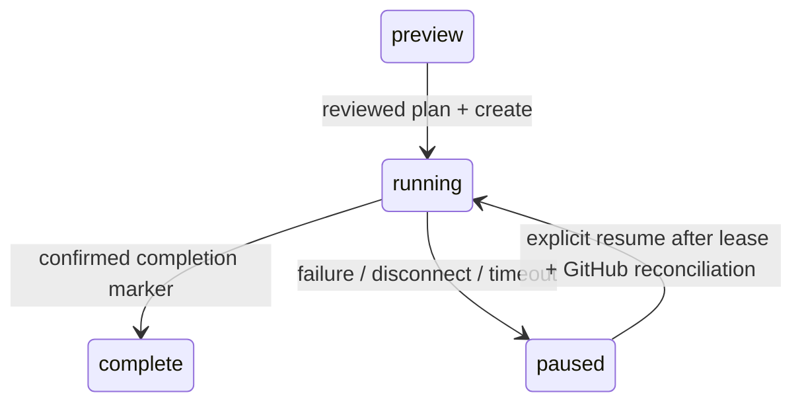

# 実装構成

`packages/pkgfactory` のみをnpm公開します。npm workspacesで `apps/cloudflare` と管理し、
内部依存を別npmパッケージとして公開しません。

| ディレクトリ | 責務 |
|---|---|
| `src/core` | Zod入力検証、Mustache描画、固定UUID・日付、プランのハッシュ |
| `src/github` | Fetch GitHub API、Device Flow、Web Crypto鍵生成、sealed box |
| `src/application` | プレビュー所有者、期限、リポジトリ排他、書込ジャーナル、照合・再開 |
| `src/node` | CLI、永続JSONストア、ループバックWeb、PAT/任意のgh |
| `src/web` | 共通画面、Fetch APIルート、CSRF、安全なエラー |
| `src/mcp` | 公式MCP SDK、stdio/Streamable HTTP共通ツール |
| `apps/cloudflare` | Worker、OAuth、暗号化セッション、Durable Objects、配備設定 |

ビルドはテンプレートとブラウザ資産を埋め込みます。`.github`・`.gitignore`を含めて
npm tarballで欠落しないことをインストール後に検証します。
コア・GitHubエンジンはNode固有APIやJuliaプロセスに依存しません。

## 状態モデル

実行前にGitHubユーザーIDを確認し、保存済みsubjectと一致させます。
Nodeローカルアダプターのみsubjectを `local` とし、起動者の資格情報を利用します。
公開Web/MCPにサーバー共通PATのフォールバックはありません。

プレビューと成功結果は15分、subjectごとのプラン上限16、同時実行8。
全体の保存件数を共通の枠で制限せず、他のsubjectの中断記録が利用枠を消費しないようにします。
中断したプラン・ロックは時間だけでは削除しません。リース終了は新しい作成の許可ではなく、
同じプランの明示的再開で照合を開始できる時刻です。

CloudflareのApplicationStateはSQLite Durable Object上でメタデータをCAS更新し、
大きな不変プランを別カラムへ保存します。subject・リポジトリ・実行中リースに索引を置き、
対象subjectの記録と排他判定に必要な記録だけを読みます。WebとMCPが同じ排他対象を共有します。
従来のKV記録は同じDurable Object内で初回起動時に移し、プラン・ジャーナル・残存ロックを保持します。
不変プランの実体が欠けた旧記録は `recoveryError=missing_plan` として隔離します。ジャーナル・ロックを保持し、実行と期限削除を拒否しますが、正常な記録の移行・利用は続行します。
NodeのFileStoreは同じディレクトリを利用する複数プロセスをファイルロックとatomic renameで直列化します。
別ディレクトリ、別ホスト、Cloudflareとローカルの間に共通ロックはありません。
GitHub上のマーカーと非強制ref更新が衝突を検出します。

## 結果不明の扱い

すべてのGitHub書き込みを `pending` として送信前に記録します。
通信例外、5xx、成功応答の読み取り失敗に対して自動再送しません。429も自動再送しません。
切断時にはジャーナル保存だけを続け、GitHubの後続操作を止めます。

Cloudflareの書込み応答はJSONに空白のkeepaliveを付けたストリームです。
作成処理中は50ms間隔とGitHub操作直前に接続へ書き込み、RequestのAbortSignalとwriterの終了を
共通のAbortSignalへ接続します。接続切断を検出した後、新しいGitHub要求を送信しません。
送信済み要求がGitHubで完了した可能性は残ります。処理をQueuesやwaitUntilへ移していません。
この応答の操作失敗はHTTP 200のJSON内 `error` またはMCP `isError` で返る場合があります。
クライアントはHTTPステータスだけで成功判定しないでください。
MCPのJSON-RPCバッチ（配列）は400で拒否します。切断監視は単一の `tools/call` ごとに行うため、バッチ内の作成を監視外で実行させないためです。MCP 2025-06-18でバッチは廃止されています。

再開ではGETでリポジトリ、default branch、マーカー、Project.toml、deploy keys、
Secretメタデータ、Pagesを照合してから残存ロックの実行権を更新します。
リポジトリ作成直後の応答喪失に備えて初期descriptionにプランIDを置き、マーカーを書いた後で
利用者のdescriptionへ変更します。証明できない既存リポジトリは引き継ぎません。
空のリポジトリをREADMEで初期化し、最初のコミット名を
`Using PkgFactory` とし、空行を挟んだ3行目に `https://github.com/JuliaPackageFactory/PkgFactory.ts` を記載します。
テンプレート追加コミットには `[skip ci]` を付け、鍵・Secret・Pages設定を終えた完了コミットでpush CIを1回起動します。
テンプレートの通常のpush/PRトリガーは変更しません。
[GitHubのコミットメッセージによるスキップ仕様](https://docs.github.com/en/actions/how-tos/manage-workflow-runs/skip-workflow-runs)
Git tree/commitだけが孤立した場合、明示的再開で新しい未参照オブジェクトを作ることがあります。

Secretの値をGitHubから読み戻すことはできません。Secret結果不明の再開は同じ秘密鍵の再送ではなく、
新しいペアへ入れ替える新規操作です。設定成功が確認できるまで古い管理鍵を削除しません。

## 認証と秘密情報

Web OAuth state・PKCE verifier・10分の期限をAES-256-GCMで暗号化したHttpOnly/Secure Cookieに保存し、AADをサービスoriginに結び付けます。
認可待ちのサーバーレコードは作りません。コールバックでブラウザとの一致・期限を検証後、stateのハッシュを原子的に一度だけ消費し、認可コードを交換します。
ログイン開始はCloudflareの接続元IPv4アドレスまたはIPv6 /64の鍵付きハッシュごとに毎分20回までです。IPv4射影アドレスは対応するIPv4と同じ枠を使います。生のIPは保存しません。
これに加え、KV・AuthStateへ書き込むかGitHubを呼ぶ匿名ルート（`/authorize`、`/callback`、`/oauth/token`、`/oauth/register`、`/auth/login`、`/auth/callback`、`/auth/logout`）は、Workers Rate Limitingで同じ鍵付きハッシュごとに合計毎分120回、動的クライアント登録は毎分10回までです。
サインイン後のWeb APIとMCPは、接続元ではなくGitHubアカウントごとに合計毎分120回を共有します。同じNATの利用者どうしが枠を奪い合いません。
Workers Rate LimitingはCloudflareの拠点ごとの概算です。一つの接続元による費用・負荷を抑えるもので、正確な全体上限ではありません。値は `wrangler.jsonc` で変更します。
AuthStateは索引による点検索と期限削除を使い、認証待ち・セッション共通の件数上限はありません。
セッションCookieにはランダムIDとそのHMAC署名、サーバーにはIDハッシュと暗号化したセッションを保存し、有効期限は8時間です。
署名鍵は `SESSION_KEY` からHKDFで暗号鍵と別に派生します。署名のないIDや偽のIDは、全利用者共通のAuthStateへ問い合わせる前に拒否します。
セッション暗号文のAADは保存先IDに結び付けます。`SESSION_KEY` の変更後などで復号できないセッションは、エラーではなく未ログインとして扱います。
ログアウトでサーバーのセッションを削除し、そのWebセッションのGitHubトークンをOAuth AppのAPIで失効させます。GitHubに接続できなくてもセッションは削除します。
OAuth providerはMCPトークンとGitHub資格情報を分離します。MCPのgrantが持つGitHubトークンは別に発行されたもので、Webのログアウトでは失効しません。
トークン・秘密鍵を操作プラン、ジャーナル、エラー本文に記録しません。
Workers Logsに残すのは、アプリのセキュリティイベント（イベント名・メソッド・パス）とOAuthライブラリの警告です。リクエストごとのinvocationログは無効で、URLのクエリ文字列（OAuth code）も削除します。アプリのイベントにはIPアドレス・トークン・アカウントIDを含めません。
OAuthライブラリのエラー応答は、クライアント入力を含み得る説明文を除き、状態・コード・固定の理由だけを記録します。ライブラリ自身の一部の警告（CIMD取得失敗など）はクライアントIDやgrant IDを含みます。
公開Web/MCPのプレビューは、保存前にGitHubの所有権と既存リポジトリを照会します。
資格情報を持たないローカルCLI/stdioのオフライン生成は引き続き利用できます。
MCPクライアントの戻り先は、HTTPS、ループバックへのHTTP、カスタムスキームに限ります。リモートのHTTPは動的登録と認可開始の両方で拒否し、CIMDクライアントや既存の登録にも適用します。
MCP同意画面ではlocalhost（末尾ドットを含む）、ループバック・未指定アドレス、IPv4射影アドレスへの転送を明示します。カスタムスキームには端末内アプリである旨を表示します。CIMDクライアントはclient_idのドメインとメタデータURLを表示します。

descriptionのREADME用描画はCommonMarkの記法をエスケープします。DocumenterのJulia Markdownとはエスケープ規則が異なるため、docs用には固定の `@raw html` ブロック内のテキストとして描画します。
利用者の `&<>` とコードフェンスの記号はHTMLエンティティ、改行は固定の ` ` へ変換し、ブロックの内容を1行に限定します。利用者はタグ・リンク・属性・別のDocumenterブロックを追加できません。通常の句読点、URL、チルダも余分なバックスラッシュなしで表示します。
これはテンプレートで使用するHTML出力用です。[Documenterのrawブロック仕様](https://documenter.juliadocs.org/stable/man/syntax/#@raw-%3Cformat%3E-block)
GitHubリポジトリのdescriptionには元の入力を使います。

鍵はWeb Cryptoで生成し、Ed25519はOpenSSH形式、RSA-4096はPKCS#1 PEM形式へ変換します。
Documenter/TagBot用Secretは秘密鍵のBase64、GitHubへの送信はlibsodium互換sealed boxです。
Nodeとworkerd双方の鍵PoC、および独立したlibsodiumによる復号試験があります。
